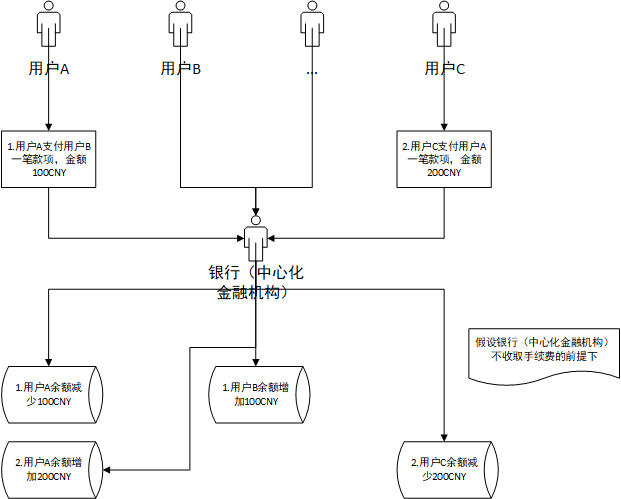
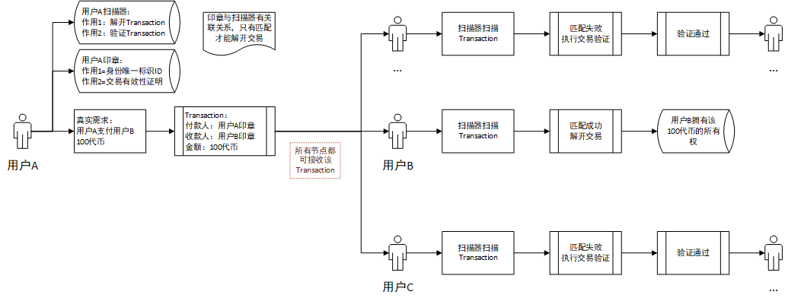
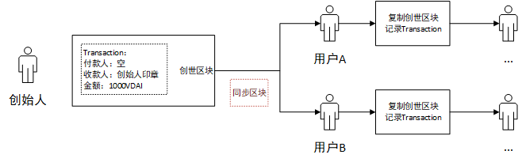
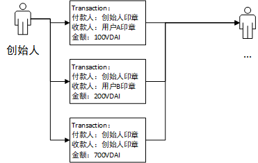
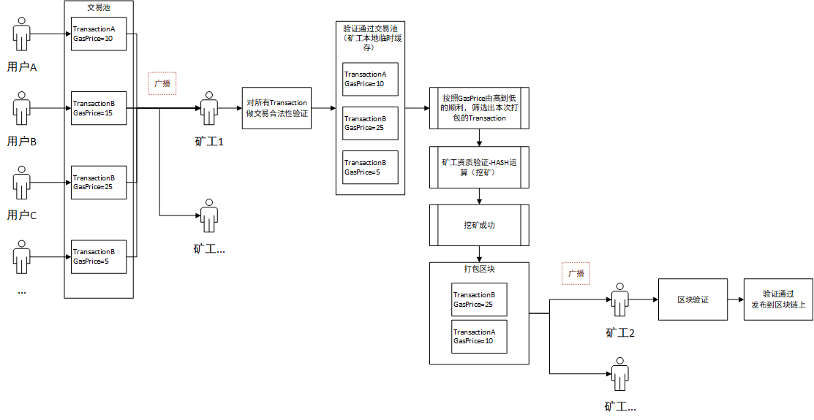

# 1、中心化记账（传统金融）

> 中心化记账流程

> 特征&问题

特征：依赖中心化机构进行记账，最终以余额的角度记录资金交易（对用户资金余额的增加or减少）

问题：有较高的资金风险，比如中心化机构可以冻结某个用户的资金，或者篡改某个用户的交易记录

# 2、公开记账

> 特征&优点

特征：依据区块链技术建立的分布式节点，每个节点都同步记账，记录的是交易本身（Transaction=付款人+收款人+付款金额）而非资金余额。公开记账认为只要总的金额是固定的，且所有参与节点都按照相同规则执行记账行为，那么每个参与方的当前可支配资金余额是可以依据Transaction推算出来的。

优点：建立了统一公开账本，全网所有人都可以随时查看该账本，并按照规则透明公开地进行记账，资金被篡改的风险相对较低

> 公开记账流程

# 3、创建创世区块

> 什么是创世区块？

就是向全网所有节点运输一个新的公开账本的第一笔Transaction的区块。

举例，假设新的公开账本总金额为1000个vita代币，简称1000VDAI

同步区块完成之后，参与同步的所有节点都知道创始人拥有1000VDAI这件事了

# 4、构建交易

那么，创始人发行了1000VDAI之后，如何构建交易，让VDAI流通起来呢？

# 5、打包Transaction+广播交易

将Transaction装进区块的过程就是“打包交易”，而打包交易的人（简称“矿工”）可以在区块上打上自己的印章，用来领取该次打包交易行为的奖励。

给矿工的奖励方式通常为代币，比如打包交易一次奖励2个VDAI。

广播交易分为两种，广播待打包的Transaction和广播待验证区块。

